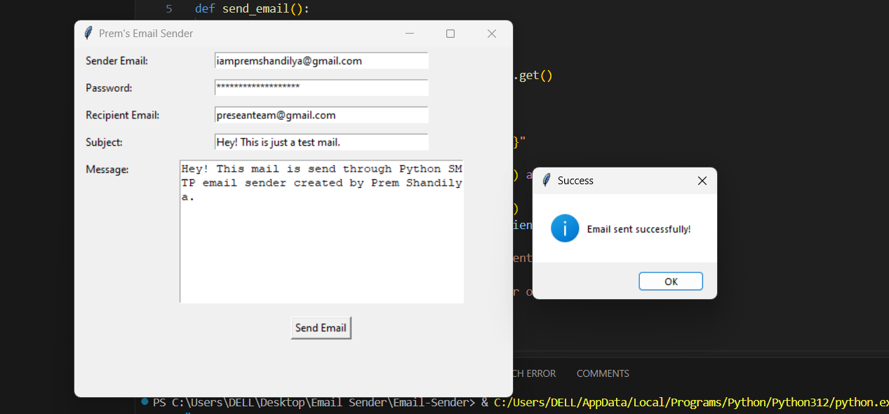

# Email-Sender
A simple Python application with a graphical user interface (GUI) to send emails using the Gmail SMTP server. Built using `smtplib` for email handling and `Tkinter` for the GUI.

---

## Features
- **Send Emails**: Allows users to send emails to any recipient.
- **User-Friendly GUI**: Easy-to-use graphical interface for entering email details.
- **Secure Login**: Requires an app-specific password for Gmail accounts.

---

## Prerequisites
Before running the application, ensure you have the following:
1. **Python 3.x** installed on your machine.
2. Required Python modules:
   - `smtplib`
   - `tkinter`
3. **App Password** for your Gmail account.
   - Enable 2-Step Verification for your Google account.
   - Generate an App Password via [Google App Passwords](https://myaccount.google.com/apppasswords).

---

## How to Use
1. Clone this repository:
   ```bash
   git clone https://github.com/soypremshandilya/Email-Sender.git
   ```
2. Navigate to the project directory:
   ```bash
   cd Email-Sender
   ```
3. Run the Python script:
   ```bash
   python email_sender.py
   ```
4. Enter the required details in the GUI:
   - Sender Email
   - Gmail App Password
   - Recipient Email
   - Subject
   - Message
5. Click **Send Email** to send the message.

---

## Screenshots


Example:
- **Main Interface**  

**Recieved Mail**


---

## Security Notes
- Do not hardcode your Gmail password in the script.
- Always use an App Password for secure access to Gmail via third-party apps.
- Avoid sharing your App Password or repository containing sensitive information.

---

## Author
Developed by [soypremshandilya](https://github.com/soypremshandilya).

---

## Contribution
Contributions are welcome! Feel free to fork this repository and create a pull request for any improvements or bug fixes.

---

## Issues
If you encounter any issues while using this application, please [open an issue](https://github.com/soypremshandilya/Email-Sender/issues).

---
